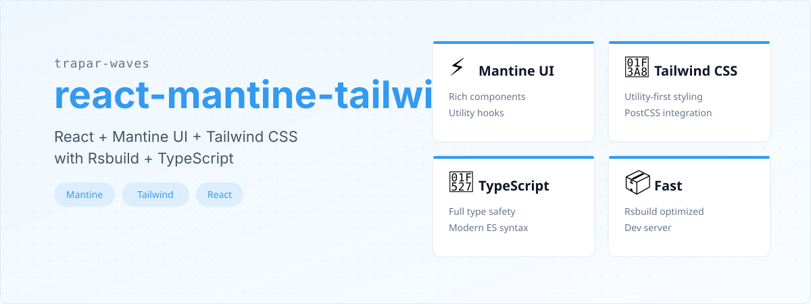

# @trapar-waves/react-mantine-tailwind


---

[English](../README.md) | [日本語](./README-JP.md) | [Русский язык](./README-RU.md)

> 一个集成 React、Mantine UI 和 Tailwind CSS 的现代 Web 开发模板，支持 Rsbuild、TypeScript、ESLint（Antfu 配置）和 Iconify。




- **现代 UI 框架：** 使用 React (v19) 构建，支持组件驱动的声明式接口。
- **丰富组件库：** 集成 Mantine UI（`@mantine/core` 和 `@mantine/hooks`），提供预构建 UI 元素和实用钩子。
- **实用优先样式：** 采用 Tailwind CSS 配合 `@tailwindcss/postcss`，实现灵活快速的样式开发，同时保持一致性。
- **PostCSS 集成：** 利用 PostCSS 插件如 `postcss-import`、`autoprefixer` 和 `postcss-simple-vars` 进行高级 CSS 处理。
- **类型安全：** 使用 TypeScript (v5.9.x) 增强代码可靠性，并在开发过程中提供强大的类型检查。
- **快速开发工作流：** 使用 Rsbuild（`@rsbuild/core` 和 `@rsbuild/plugin-react`）实现优化构建和高效开发服务器性能。
- **图标支持：** 包含 `@iconify/json` 和 `@iconify/tailwind`，提供可扩展和可定制的图标库。
- **一致的设计语言：** 结合 `postcss-preset-mantine` 和 `tailwind-preset-mantine`，实现 Mantine 和 Tailwind 样式的无缝集成。
- **代码质量：** 包含 ESLint 和 `@antfu/eslint-config`，用于代码检查和最佳实践执行。
- **Git Hooks：** 集成 Husky 和 `lint-staged`，在提交时自动进行代码质量检查。
- **自动化发布：** 利用 GitHub Actions 进行自动化发布和变更日志生成。


- **框架/库：** React (v19)
- **UI 工具包/样式：** Mantine UI（`@mantine/core`）、Tailwind CSS（`tailwindcss`）
- **构建工具：** Rsbuild（`@rsbuild/core`）
- **语言：** TypeScript (v5.9.x)
- **CSS 处理：** PostCSS 及插件如 `autoprefixer` 和 `postcss-simple-vars`
- **代码检查：** ESLint 和 `@antfu/eslint-config`
- **状态管理：** Zustand
- **路由：** Tanstack Router
- **数据获取：** Tanstack Query (React Query)
- **表格组件：** Tanstack Table

查看 [package.json](../package.json) 获取完整的依赖列表。


## 前置条件

- Node.js（推荐 >= 18.x）
- 包管理器（npm、yarn 或 pnpm）

### 安装

1. 使用模板创建新项目：

   ```bash
   pnpm create trapar-waves
   ```

2. 导航到项目目录并安装依赖：

   ```bash
   pnpm install
   ```

3. 启动开发服务器：

   ```bash
   pnpm dev
   ```


```
├── public/            # 静态资源
├── src/               # 源代码
│   ├── app.tsx        # 主应用组件
│   ├── globals.css    # 全局样式和 Tailwind 导入
│   ├── index.tsx      # 入口点
│   ├── iconify.ts     # Iconify 配置
│   └── env.d.ts       # 环境类型声明
├── rsbuild.config.ts  # Rsbuild 配置
├── tsconfig.json      # TypeScript 配置
├── eslint.config.js   # ESLint 配置
└── package.json       # 项目依赖和脚本
```


欢迎贡献，非常感谢！请按照以下步骤贡献：

1. Fork 仓库
2. 创建特性分支（`git checkout -b feature/amazing-feature`）
3. 提交更改（`git commit -m 'Add some amazing feature'`）
4. 推送到分支（`git push origin feature/amazing-feature`）
5. 创建 Pull Request


MIT License © 2025 Trapar Waves

## 👤 作者

- **Rikka：** [admin@rikka.cc](mailto:admin@rikka.cc)
- **GitHub 主页：** [Muromi-Rikka](https://github.com/Muromi-Rikka)

## 🔗 链接

- **仓库：** [https://github.com/Trapar-waves/react-mantine-tailwind](https://github.com/Trapar-waves/react-mantine-tailwind)
- **Issues：** [https://github.com/Trapar-waves/react-mantine-tailwind/issues](https://github.com/Trapar-waves/react-mantine-tailwind/issues)
